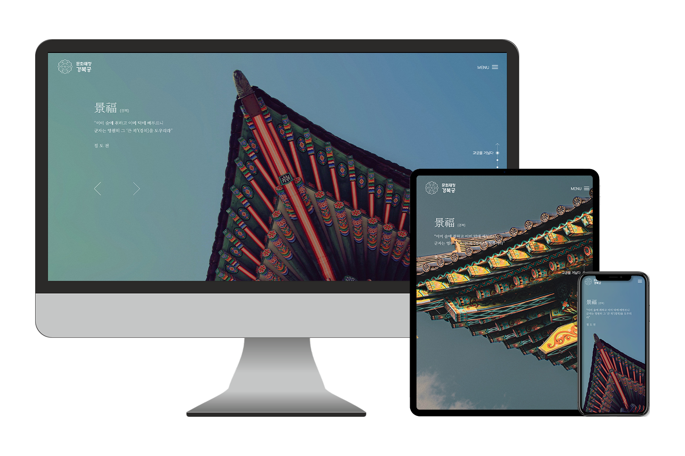
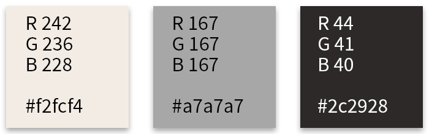

# 경복궁 - 웹사이트 리뉴얼 프로젝트
#### 팀원
> 김의진, 김희주, 이동건, 장지희, 진영원

#### 작업소요기간
> 6주 (5월 첫째주 ~ 6월 둘째주)

---


## 01. CONCEPT
대중의 시선 집중, 정보 전달, 편의성 증가에 중점을 두었습니다. 그에 따라 집중력을 저해하는 과한 텍스트를 제외하거나 방문자가 흥미를 가질만한 방식으로 변경하는 등 현대에 맞는 모던함, 높은 접근성이라는 리뉴얼 전략을 수립했습니다.

## 02. GRID SYSTEM
> Full width: 2560px   
Grid width: 1920px

> Column width: 128px   
Gutter width: 105px   
Number of columns: 9

> Sub page width: 1320px

## 03. TYPOGRAPHY
* [Noto Serif KR](https://fonts.google.com/noto/specimen/Noto+Serif+KR?selected=Material+Icons "Noto Serif KR")
* [Pretendard](https://github.com/orioncactus/pretendard "Pretendard")

## 04. COLOR SYSTEM ```#f2fcf4``` ```#a7a7a7``` ```#2c2928```   



경복궁의 고풍스러움과 멋스러움을 드러내기 위해 기존의 웹사이트와 다르게 전반적으로 채도가 높지 않은 톤을 유지했습니다. 경복궁이 지닌 오랜 역사와 웅장함을 드러내고, '왕이 머문 처소'라는 의미를 살리기 위해 진중한 분위기를 조성하고자 했습니다.

## 05. LOGO DESIGN


## 06. PAGE DESIGN
메인 페이지는 웹사이트 방문객의 첫인상을 좌우하는 대문인만큼 디자인적인 면과 기능적인 면 모두를 놓치지 않고자 노력했습니다. 한번의 스크롤마다 하나의 섹션이 보여지도록 기능을 구현하였고 각 섹션에는 주메뉴의 내용을 간략히 담아 방문자에게 이정표가 될 수 있도록 컨텐츠를 구성했습니다.
